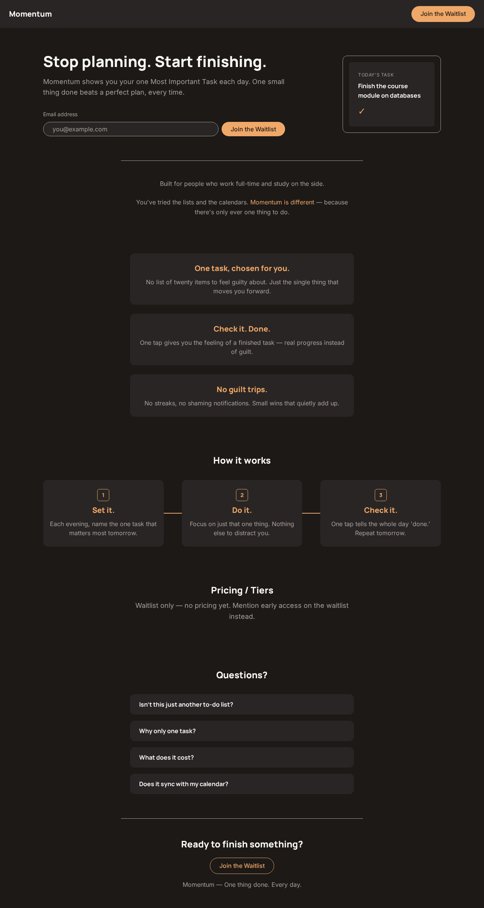

# Momentum

**One thing done. Every day.**

[](https://html.spec.whatwg.org/)
[](https://www.w3.org/Style/CSS/)
[](https://javascript.info/)
[](https://github.com/Kamal-Hussain23/Momentum)
[](LICENSE)

## Deliverables at a glance

| # | Deliverable | Value |
|---|-------------|-------|
| 1 | Startup name | **Momentum** |
| 2 | Value proposition | We help busy professionals who study on the side stop feeling "busy but stuck" and finally finish what matters, by narrowing every day down to a single Most Important Task. |
| 3 | GitHub repository | https://github.com/Kamal-Hussain23/Momentum |
| 4 | Public deployed URL | https://kamal-hussain23.github.io/Momentum/ |

## Table of contents

- [Preview](#preview)
- [The problem it solves](#the-problem-it-solves)
- [The solution](#the-solution)
- [Key features](#key-features)
- [How to run locally](#how-to-run-locally)
- [Project structure](#project-structure)
- [Tech stack](#tech-stack)
- [Design system & docs](#design-system--docs)
- [Roadmap](#roadmap)
- [Reflection](#reflection)
- [License](#license)

## Preview



> **Live site:** [https://kamal-hussain23.github.io/Momentum/](https://kamal-hussain23.github.io/Momentum/) (GitHub Pages, auto-updated on every push).
>
> During development it is also served live from a Codio box at the temporary URL
> `https://${CODIO_HOSTNAME}-3000.codio.io/` while the server is running.

## The problem it solves

Busy professionals who study on the side (a certification, a course, a promotion-lane
skill) always have plans — but they don't do them. They feel **"busy but stuck."** The
guilt that follows sets off a loop: procrastinate → feel guilty → stress → burnout →
procrastinate more. They already have calendars and to-do lists; the lists just hand
them twenty things at once and none of them get finished.

## The solution

Momentum is an app that closes the gap between planning and doing by narrowing each day
down to a single **Most Important Task (MIT)**. It is not another calendar or to-do
list. There's only ever one thing to do, so that one thing is small enough to actually
get done.

This repository is the **frontend landing page** for Momentum. It names the problem,
presents the solution, and collects waitlist emails — one signup, one click, no friction.

## Key features

- **Hero section** — "Stop planning. Start finishing." with a waitlist form and a
  CSS-only phone mockup showing the daily task card.
- **Social proof** — built for people who work full-time and study on the side.
- **Feature highlights** — "One task, chosen for you", "Check it. Done.", "No guilt
  trips."
- **How it works** — a numbered 3-step path: **Set it → Do it → Check it**, with
  visible separators so each step reads as its own milestone.
- **FAQ accordion** — opens one answer at a time, with ARIA states for screen readers.
- **Waitlist form** — collects an email address with a single primary CTA.
- **Subtle motion** — a clean hero entrance animation, a smooth hover lift on the
  feature cards, and full `prefers-reduced-motion` support.

## How to run locally

The site is plain HTML/CSS/JS, so any static file server works. Python ships with most
machines:

1. From the project folder, start the server:

   ```bash
   python3 -m http.server 3000 --bind 0.0.0.0
   ```

2. Open the page:
   - **In a Codio box:** `https://${CODIO_HOSTNAME}-3000.codio.io/`
   - **On a regular machine:** `http://localhost:3000/`

3. Sanity check it is up:

   ```bash
   curl -s -o /dev/null -w "%{http_code}\n" http://localhost:3000/   # → 200
   ```

## Project structure

```
build-lab/
├── index.html      Landing page structure
├── style.css       All styles + design tokens (CSS custom properties)
├── script.js       Interactions (FAQ accordion) — vanilla JS
├── MISSION.md      Founder Notebook — vision, design system, decision log
├── SPECS/          Project constitution (planning space, not part of the site)
├── assets/         README screenshots
├── LICENSE         MIT license
└── README.md       You are here
```

## Tech stack

Everything is vanilla — no frameworks, no build tools, no npm packages.

- **HTML5** — semantic markup and ARIA attributes for the FAQ accordion
- **CSS3** — design tokens as CSS custom properties, Flexbox layouts, keyframe
  animations, and responsive breakpoints
- **JavaScript** — vanilla JS for the FAQ accordion (no libraries)
- **Fonts** — Manrope (headings) + Inter (body) via Google Fonts
- **Design system** — the color palette, typography, button styles, and radius rules
  are locked in `MISSION.md` and used everywhere via `:root` tokens
- **Local preview** — a simple Python HTTP server in the Codio box
  (`python3 -m http.server 3000 --bind 0.0.0.0`)

## Design system & docs

- **[`MISSION.md`](MISSION.md)** — the Founder Notebook: vision, color palette,
  typography, button styles, page architecture, and the decision log.
- **[`SPECS/ROADMAP.md`](SPECS/ROADMAP.md)** — the six-stage journey from blank canvas
  to live startup, with the current state.
- **[`SPECS/TECH.md`](SPECS/TECH.md)** — the engineering rules (no frameworks, motion
  budget, design tokens first) and file structure.

## Roadmap

**Current state** — the landing page is built and all acceptance suites pass. What
remains is shipping.

- The **5-Point Quality Audit** (Stage 5) — fix Critical + Important issues.
- **Stage 6** — 1-Minute Human Test with a peer, triage feedback, then deploy to
  GitHub Pages, Vercel, or Netlify.
- **Founder Reflection** — answer the 5 reflection questions in `MISSION.md`.

Once live, natural next steps: a real waitlist form with a small backend, individual
feature pages, and copy iterations based on real visitor behavior.

## Reflection

This project taught us that you don't need heavy tools to make something feel
professional — you need **consistency and restraint**.

The design tokens in `MISSION.md` were the biggest win. Because every color, radius, and
font lived in one place in CSS, the whole page stayed on-brand without thinking about
it. Adding new sections became a matter of reusing tokens, never reinventing them.

We also learned to respect motion. It's tempting to add a scroll-triggered animation to
every block, but visitors see the page once — so we kept a single hero entrance
animation and one hover effect, and made sure both respect `prefers-reduced-motion`.
The hover lift is animated with `transform` (not layout properties), so it stays smooth.

Along the way we learned the value of **verifying instead of assuming**. Every design
choice — the hover lift timing, the stagger of the hero entrance, the step separators —
was measured in a real headless browser to confirm it felt snappy, matched the tokens
exactly, and produced zero console errors.

The biggest surprise was how much the "one thing" constraint helped the design too. One
task, one CTA, one conversion goal — the same discipline that shapes the product shaped
the page.

## License

[MIT](LICENSE) © 2026 Kamal Hussain